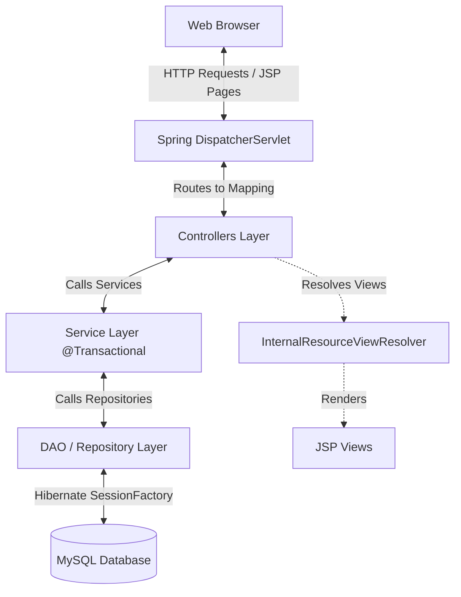
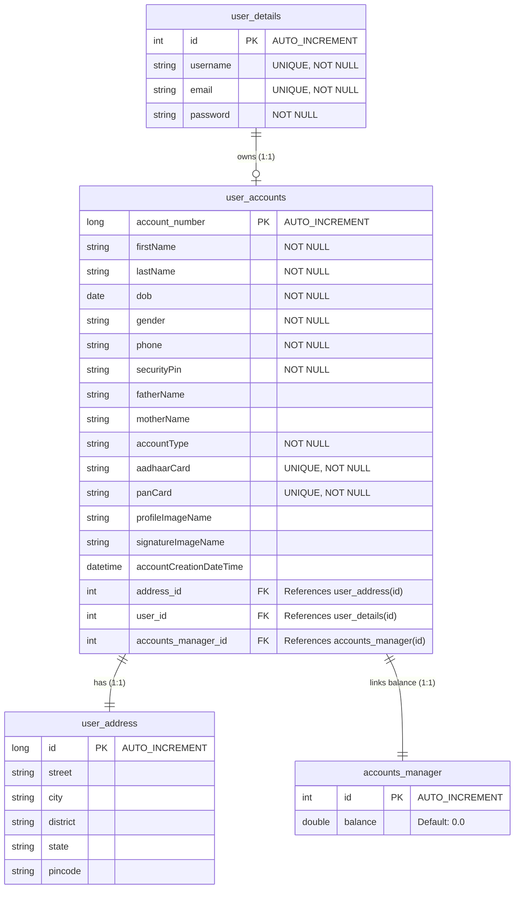

# 🏦 NexusBank - Online Banking Portal

Welcome to **NexusBank**, a secure and feature-rich online banking web application built using **Spring MVC** and **Hibernate**. The platform enables seamless user registration, banking account setup (with KYC image uploads), secure transactions (deposits & withdrawals), real-time balance inquiries, and profile/PIN management.

---

## 🚀 Key Features

* **User Authentication System:** Secure registration and login operations with validation checks for duplicate usernames or email IDs.
* **KYC-Compliant Account Creation:**
  * Interactive form collecting personal details, parent names, date of birth, and identity proofs (Aadhaar & PAN).
  * Secure uploads for user profile pictures and signatures (with file format and size constraints).
  * Automated unique account number generation.
* **Transaction Management Hub:**
  * **Initial Deposit:** Mandated minimum deposit during bank account registration.
  * **Regular Deposits:** Add funds safely to the account by confirming the transaction security PIN.
  * **Withdrawals:** Withdraw money securely with instant balance validation and PIN verification.
  * **Balance Inquiry:** Real-time checking of account balances via a secure modal popup.
* **Security & Configuration:**
  * Access control checks redirecting unauthenticated users to the login screen.
  * PIN-change facility validating current security credentials.
* **Bank Info Center:** Quick lookup of customer support and branch details (IFSC, branch code, and address).

---

## 🛠️ Technology Stack

| Component | Technology | Version / Details |
| :--- | :--- | :--- |
| **Java Platform** | Java JDK | 17 |
| **MVC Framework** | Spring MVC | 6.1.10 (using Jakarta EE APIs) |
| **Persistence / ORM** | Spring ORM + Hibernate | 6.5.2.Final (JPA 3.1.0 specification) |
| **Database** | MySQL | 8.4.0 (Connector-J driver) |
| **Templating Engine** | JSP & JSTL | Jakarta Servlet JSP JSTL (Glassfish implementation) |
| **File Processing** | Apache Commons | FileUpload (1.4) & IO (2.11.0) |
| **Server** | Apache Tomcat | Tomcat 10.x / 11.x (Jakarta namespace support) |
| **Build Automation** | Apache Maven | XML-driven configuration (`pom.xml`) |

---

## 🏛️ System Architecture

NexusBank follows the clean **Model-View-Controller (MVC)** design pattern, separating concerns between user presentation, business logic, and database operations.



### Layer Breakdown
1. **Presentation Layer (JSP/CSS/JS):** Displays banking portals, success notifications, forms, and validation alerts.
2. **Controller Layer (Spring MVC Controllers):** Maps incoming URL routes, validates form data, manages HTTP session scopes (storing logged-in users and account objects), and processes file uploads.
3. **Service Layer (Spring Service):** Contains business transaction boundaries (`@Transactional`) managing atomic bank deposits, withdrawals, and security PIN updates.
4. **DAO Layer (Hibernate Repositories):** Interacts directly with the database using Hibernate's `SessionFactory` and HQL (Hibernate Query Language).
5. **Database Layer (MySQL):** Stores entity schemas for users, addresses, accounts, and ledger data.

---

## 🗄️ Database Schema & Relationships

The database structure consists of four relational tables mapped as JPA entities in the `springMVCproject.model` package.



---

## 📁 Folder Structure

```directory
SpringMVCproject/
├── .settings/                       # IDE Configuration settings
├── src/
│   └── main/
│       ├── java/
│       │   └── springMVCproject/
│       │       ├── controller/      # Web controllers handling user requests
│       │       ├── Services/        # Transaction & business logic layer
│       │       ├── Dao/             # Hibernate database interaction classes
│       │       └── model/           # JPA entities & data models
│       ├── resources/               # Resource configuration properties
│       └── webapp/
│           ├── WEB-INF/
│           │   ├── spring-servlet.xml # Database beans, transaction settings, and MVC configurations
│           │   ├── web.xml          # Servlet dispatcher and upload configs
│           │   └── views/           # JSP UI Pages (Home, login, signup, transaction pages)
│           └── resources/
│               ├── css/             # Styling stylesheets
│               └── images/          # Uploaded profile photos & signatures
├── pom.xml                          # Maven build file detailing dependencies
└── README.md                        # Project documentation (this file)
```

---

## 🔗 Endpoint Reference

Below is a summary of the mapped endpoints in the controller layer:

| Request Method | Endpoint | Handler Class | Description | Access Restriction |
| :--- | :--- | :--- | :--- | :--- |
| **GET / POST** | `/`, `/home` | `HomeController` | Renders the application home landing page. | Public |
| **GET** | `/services` | `HomeController` | Renders list of available bank actions. | Public |
| **GET** | `/login` | `LoginController` | Renders user login form. | Public |
| **POST** | `/login-submit` | `LoginController` | Processes login credentials & loads user session. | Public |
| **GET** | `/signup` | `LoginController` | Renders new registration page. | Public |
| **POST** | `/signup-submit` | `LoginController` | Validates details and creates new login user. | Public |
| **GET** | `/logout` | `LoginController` | Invalidates current HTTP session. | Session |
| **GET** | `/create-account` | `AccountController` | Renders bank account creation and KYC upload. | Session |
| **POST** | `/create-account-submit` | `AccountController` | Validates inputs, saves files, initiates deposit flow. | Session |
| **GET** | `/change-pin` | `AccountController` | Renders PIN-change form interface. | Session (Account Required) |
| **POST** | `/change-pin-submit` | `AccountController` | Validates current PIN and persists new PIN value. | Session (Account Required) |
| **GET** | `/deposite` | `TransactionController` | Renders deposit interface (initial/regular). | Session (Account Required) |
| **POST** | `/deposite-submit` | `TransactionController` | Processes credit to account balance. | Session (Account Required) |
| **GET** | `/withdraw` | `TransactionController` | Renders debit interface. | Session (Account Required) |
| **POST** | `/withdraw-submit` | `TransactionController` | Validates and processes fund withdrawal. | Session (Account Required) |
| **GET** | `/check-balance` | `TransactionController` | Displays account balance query page. | Session (Account Required) |
| **POST** | `/check-balance-submit` | `TransactionController` | Verifies PIN and returns balance value. | Session (Account Required) |
| **GET** | `/account-success` | `HomeController` | Page confirming successful registration. | Session (Account Required) |
| **GET** | `/bank-details` | `BankInfoController` | Displays branch specifics, address, and support. | Public |

---

## ⚙️ Setup and Installation Instructions

Follow these steps to set up and run the application locally.

### 1. Prerequisites
Ensure you have the following installed on your machine:
* **Java Development Kit (JDK) 17**
* **Apache Maven 3.8+**
* **MySQL Community Server 8.x**
* **Apache Tomcat 10.x** (Required for Jakarta EE namespace support)
* An IDE (Eclipse, IntelliJ IDEA, or VS Code)

### 2. Database Configuration
1. Log in to your MySQL terminal or database client.
2. Create a new database schema named `banking_system`:
   ```sql
   CREATE DATABASE banking_system;
   ```
3. Update connection credentials in [spring-servlet.xml](file:///c:/Users/mayan/DevloperCompleteFolder/Backend/SpringMVCproject/src/main/webapp/WEB-INF/spring-servlet.xml#L50-L55):
   ```xml
   <bean class="org.springframework.jdbc.datasource.DriverManagerDataSource" name="ds">
       <property name="driverClassName" value="com.mysql.cj.jdbc.Driver" />
       <property name="url" value="jdbc:mysql://localhost:3306/banking_system" />
       <property name="username" value="your_mysql_username" />
       <property name="password" value="your_mysql_password" />
   </bean>
   ```
   *(Note: The Hibernate settings are configured to `update` (`hibernate.hbm2ddl.auto`), so table structures will be auto-generated upon the first deployment).*

### 3. Build the Application
Use Maven to clean the directory and package the project into a standard `WAR` package:
```bash
mvn clean package
```
This produces a `springmvc.war` inside the `target/` directory.

### 4. Deployment
#### Deploying to Standalone Tomcat:
1. Copy the compiled `springmvc.war` file from the `target/` directory.
2. Paste it in your Tomcat's `webapps/` folder.
3. Start the Tomcat server. The app will deploy automatically, making it accessible at: `http://localhost:8080/springmvc/`

#### Running with Tomcat IDE Plugins (e.g., Smart Tomcat in IntelliJ/Eclipse):
1. Configure a new Tomcat Server configuration in your IDE, pointing to Tomcat 10+.
2. Set the deployment context path to `/` or `/springmvc`.
3. Start/Run the server configuration.

---

## 🔒 Security Best Practices Implemented
* **Transactional integrity:** Database updates are bound to `@Transactional` parameters ensuring that partial transactions are rolled back if an error occurs.
* **Input validation:** Validates file type (`.png`) and file size boundaries. Includes validation for duplicate entries (Aadhaar & PAN uniqueness checks).
* **Scope integrity:** Sensitive transaction routes require explicit HTTP session lookups to verify logged-in status.
